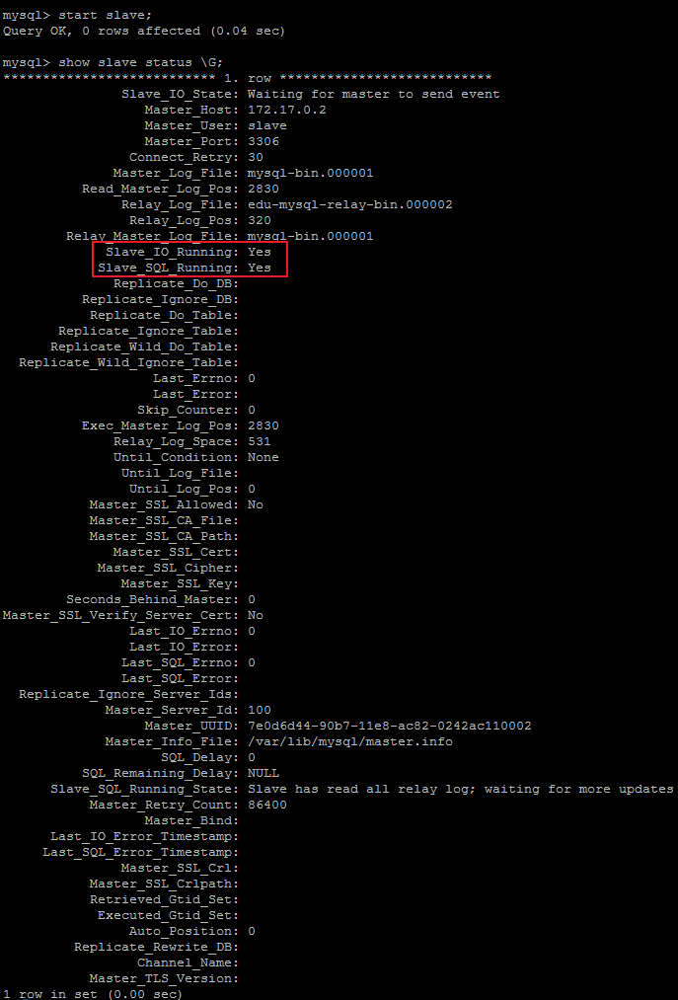

# 基于Docker的Mysql主从复制搭建

------

## 利用Docker搭建主从服务器

1. 首先拉取docker镜像 `docker pull mysql`
2. 然后使用此镜像启动容器，这里需要分别启动主从两个容器
**Master(主)：** 
```shell
docker run -p 3339:3306 --name master-mysql -e MYSQL_ROOT_PASSWORD=123456 -d mysql
```

**Slave(从)：**
```shell
docker run -p 3340:3306 --name slavemysql -e MYSQL_ROOT_PASSWORD=123456 -d mysql
```
Master对外映射的端口是3339，Slave对外映射的端口是3340。因为docker容器是相互独立的，每个容器有其独立的ip，所以不同容器使用相同的端口并不会冲突。这里我们应该尽量使用mysql默认的3306端口，否则可能会出现无法通过ip连接docker容器内mysql的问题。

使用`docker ps`查看docker查看正在运行的容器


使用Navicat等工具测试连接mysql


如果出现`2059 Authentication plugin 'caching_sha2_password'`错误
进入docker的mysql容器中在mysql终端执行
```shell
ALTER USER 'root'@'%' IDENTIFIED WITH mysql_native_password BY '123456';
```

**配置Master(主)**

通过`docker exec -it 627a2368c865 /bin/bash`命令进入到Master容器内部，也可以通过`docker exec -it mysql-master /bin/bash`命令进入。627a2368c865是容器的id,而mysql-master是容器的名称。

`cd /etc/mysql`切换到`/etc/mysql`目录下，然后`vi my.cnf`对my.cnf进行编辑。此时会报`出bash: vi: command not found`，需要我们在docker容器内部自行安装vim。使用apt-get install vim命令安装vim

会出现如下问题：
```shell
Reading package lists... Done
Building dependency tree       
Reading state information... Done
E: Unable to locate package vim
```
执行`apt-get update`，然后再次执行`apt-get install` vim即可成功安装vim。然后我们就可以使用vim编辑my.cnf，在my.cnf中添加如下配置：

```shell
[mysqld]
## 同一局域网内注意要唯一
server-id=100  
## 开启二进制日志功能，可以随便取（关键）
log-bin=mysql-bin
```

配置完成之后，需要重启mysql服务使配置生效。使用service mysql restart完成重启。重启mysql服务时会使得docker容器停止，我们还需要docker start mysql-master启动容器。

下一步在Master数据库创建数据同步用户，授予用户` slave REPLICATION SLAVE`权限和`REPLICATION CLIENT`权限，用于在主从库之间同步数据。

```sql
CREATE USER 'slave'@'%' IDENTIFIED BY '123456';

GRANT REPLICATION SLAVE, REPLICATION CLIENT ON *.* TO 'slave'@'%';
```


**配置Slave(从)**
和配置Master(主)一样，在Slave配置文件my.cnf中添加如下配置：
```shell
[mysqld]
## 设置server_id,注意要唯一
server-id=101  
## 开启二进制日志功能，以备Slave作为其它Slave的Master时使用
log-bin=mysql-slave-bin   
## relay_log配置中继日志
relay_log=edu-mysql-relay-bin  
```

配置完成后也需要重启mysql服务和docker容器，操作和配置Master(主)一致。

**链接Master(主)和Slave(从)**
在Master进入mysql，执行`show master status;`


File和Position字段的值后面将会用到，在后面的操作完成之前，需要保证Master库不能做任何操作，否则将会引起状态变化，File和Position字段的值变化。

在Slave 中进入 mysql，执行
如果是第一次则执行
```sql
change master to master_host='172.17.0.2', master_user='slave', master_password='123456', master_port=3306, master_log_file='mysql-bin.000003', master_log_pos= 155, master_connect_retry=30;
```
或
```sql
change master to Master_Log_File='mysql-bin.000003',Master_Log_Pos=155;
```
**命令说明：**
>* **master_host** ：**Master的地址，指的是容器的独立ip,可以通过

```shell
docker inspect --format='{{.NetworkSettings.IPAddress}}' 容器名称|容器id查询容器的ip
```


>* **master_port**：Master的端口号，指的是容器的端口号
>* **master_user**：用于数据同步的用户
>* **master_password**：用于同步的用户的密码
>* **master_log_file**：指定 Slave 从哪个日志文件开始复制数据，即上文中提到的 File 字段的值
>* **master_log_pos**：从哪个 Position 开始读，即上文中提到的 Position 字段的值
>* **master_connect_retry**：如果连接失败，重试的时间间隔，单位是秒，默认是60秒

在Slave 中的mysql终端执行`show slave status \G;`用于查看主从同步状态


正常情况下，**SlaveIORunning** 和 **SlaveSQLRunning** 都是**No**，因为我们还没有开启主从复制过程。使用`start slave`开启主从复制过程，然后再次查询主从同步状态`show slave status \G;`。



**SlaveIORunning** 和 **SlaveSQLRunning** 都是Yes，说明主从复制已经开启。此时可以测试数据同步是否成功。

**主从复制排错：**


使用`start slave`开启主从复制过程后，如果**SlaveIORunning**一直是**Connecting**，则说明主从复制一直处于连接状态，这种情况一般是下面几种原因造成的，我们可以根据 **Last_IO_Error**提示予以排除。
>* 网络不通 检查ip,端口
>* 密码不对 检查是否创建用于同步的用户和用户密码是否正确
>* pos不对 检查Master的 Position

**测试主从复制**
测试主从复制方式就十分多了，最简单的是在Master创建一个数据库，然后检查Slave是否存在此数据库。\
**Master:**


**Slave:**

