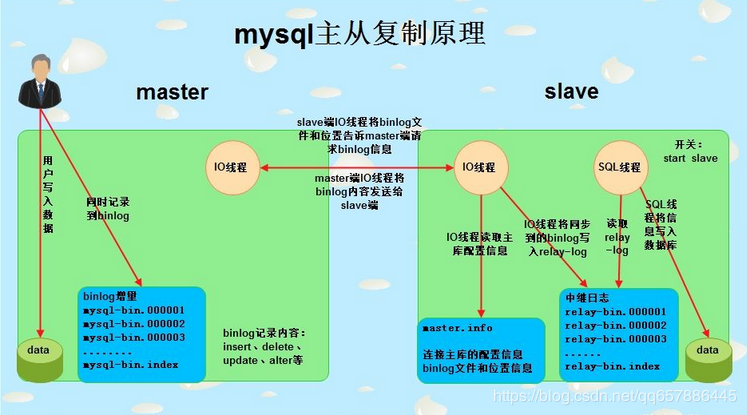

# MySQL主从复制，并行复制，半同步复制和组复制

------

## 主从复制

主从复制过程存在三个线程，`Master端的I/O线程`，`Slave的I/O线程与SQL线程`。Master端需要开启binlog日志，Slave端需要开启`relaylog`。

 1. Slave端的I/O读取master.info文件，获取binlog文件名和位置点，然后向Master端的I/O线程请求，该binlog文件名和位置点的binlog信息。（master.info文件在配置主从复制时使用`change master`命令来指定生成）
 2. Master端的I/O线程会根据Slave端的I/O线程请求的信息来读取Master的binlog日志信息与及读取到最新的binlog文件名和位置点一同返回给Slave的I/O线程。
 3. Slave端的I/O线程会把获取到的binlog日志写入relaylog（中继日志）文件中，并且更新master.info文件信息。（把读取到Master最新的binlog日志文件名和位置点更新到master.info文件中，下一次当前位置去读取Master的binlog日志）
 4. Slave端的SQL线程会定期读取relaylog，把二进制的日志解析成SQL语句，并执行这些SQL语句，同步数据到从库中。

原理图:
